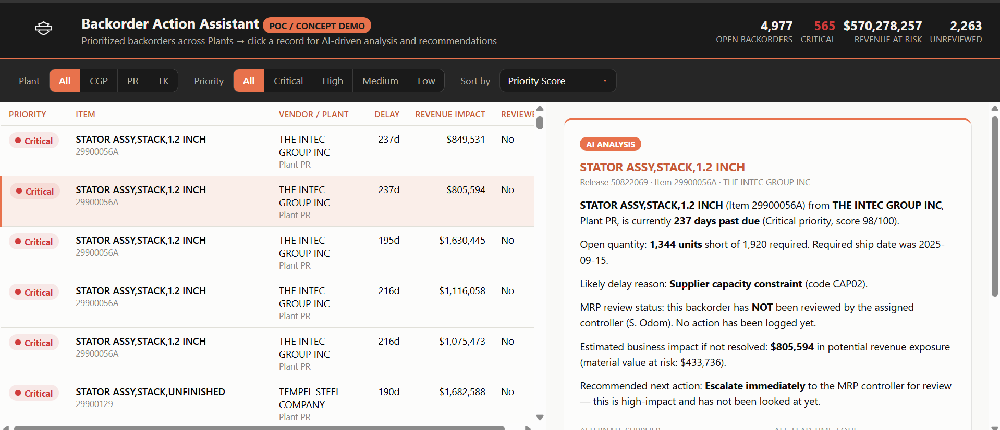
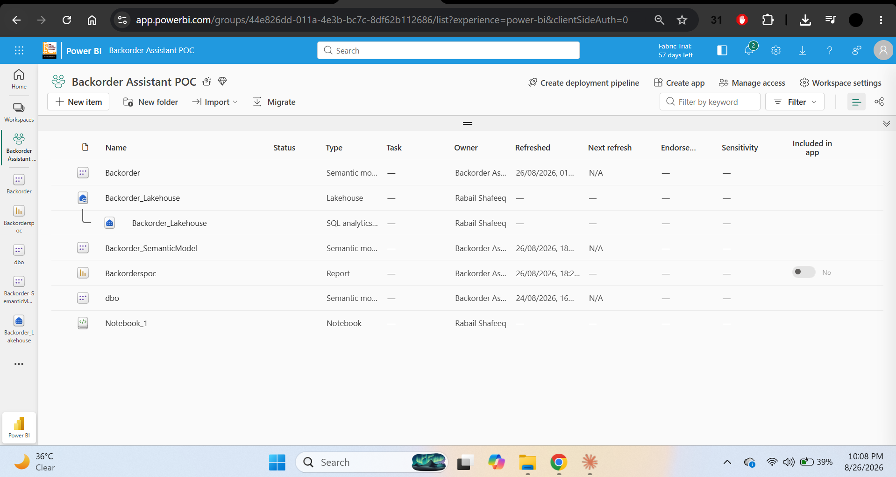
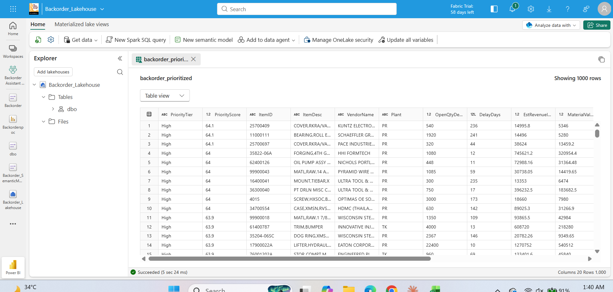
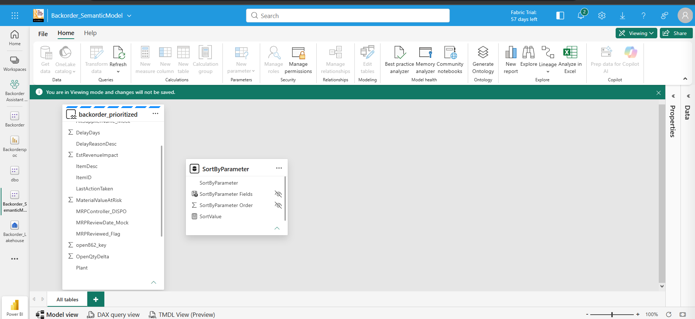
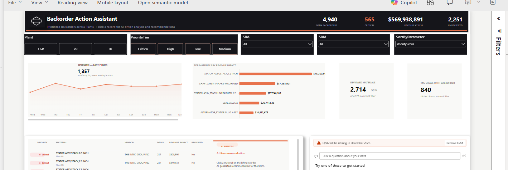

# Backorder Action Assistant

An interactive backorder-prioritization dashboard built to turn a raw, exploded Power BI export into a scored, explainable action list for MRP controllers — first shipped as a standalone HTML proof of concept, then rebuilt natively in Power BI (Deneb/Vega-Lite custom visuals + native slicers) for enterprise deployment.



## What this project does

Materials teams tracking open backorders need more than a flat list — they need to know *which* backorder to act on first, *why* it matters, and what to do about it. This project takes a messy real-world Power BI export (over 1,000,000 rows, most of them duplicate artifacts of the source report's own date-axis charting) and turns it into a clean, prioritized, AI-annotated action list, delivered as a live dashboard.

Two versions exist:

1. **Standalone HTML POC** (`html-demo/`) — a fully self-contained interactive demo built to validate the concept and design before touching Power BI.
2. **Power BI production build** (`deneb-specs/`) — the same look and interaction model, rebuilt using Deneb (a certified Vega-Lite visual) plus native Power BI slicers and KPI cards, after the client's IT department could not approve a custom third-party visual for security reasons.

## Data pipeline (Microsoft Fabric notebook)

The full transformation logic lives in [`notebook/Backorder_POC_Code_Walkthrough.ipynb`](notebook/Backorder_POC_Code_Walkthrough.ipynb) and runs as a notebook inside a Microsoft Fabric workspace, feeding the semantic model that both the Power BI report and the HTML demo's data are built from.

| Stage | What it does |
|---|---|
| **1. Clean** | Recovers true one-row-per-backorder records from a raw export that had exploded to 1M+ rows (each real record repeated once per calendar day for the source report's own date-axis charts), using the same internal key (`open862_key`) and representative-row flags Power BI itself relies on. |
| **2. Enrich** | Generates the SAP-style fields that don't exist in the Power BI export (unit cost, revenue impact, MRP review status) **deterministically** from each record's own identifiers via hashing — so the same record always produces the same mock values on re-run, with no randomness. |
| **3. Score** | Converts revenue impact, delay days, and material value onto a common 0–100 percentile scale (so a multi-million-dollar item and a two-day delay don't distort each other), then combines them into a single weighted `PriorityScore` (revenue 40%, delay 25%, material value 20%, plus a bonus for anything not yet reviewed). |
| **4. Explain** | Generates the natural-language AI recommendation panel and answers free-form questions via template-based generation and intent-keyword matching — not a live LLM call, which keeps the demo 100% reliable with zero external API dependency while mirroring exactly the record structure a live LLM integration would consume. |

This pipeline stage (`01_Source_PBIX` → `02_Extracted_Data` → `03_Mock_SAP_Data` clean/enriched/prioritized) is what feeds the final semantic model both dashboards read from.

**The Fabric workspace itself:**


*The workspace: a Lakehouse holding the transformed data, the notebook that produced it, a semantic model, and the Power BI report — all in one place.*


*The `backorder_prioritized` table in the Lakehouse after the notebook runs — every row carries its computed `PriorityScore` alongside the enriched SAP-style fields.*


*The semantic model built on top of the Lakehouse table, ready to be consumed by both the Power BI report and the Q&A visual.*

## Dashboard build

**HTML demo** (`html-demo/Backorder_Action_AssistantPOC.html`) — open directly in any browser. Dark header with live KPI stats, a filter bar, sortable/prioritized backorder table, and a click-to-drill-down AI recommendation panel.

**Power BI build** (`deneb-specs/`) — recreates the same experience entirely with certified, IT-approved visuals:

- `0_header.json` — dark header bar with title, live KPI stats (open backorders, critical count, revenue at risk, unreviewed count), all responsive to the report's actual container width.
- `0b_filter_bar_bg.json` — the dark filter-bar background sitting behind the native Power BI slicers.
- `1_top_materials.json`, `2_materials_backorder.json`, `3_reviewed_materials.json`, `4_activity_line.json` — the four trend/KPI cards (top materials by revenue impact, materials with backorder, reviewed materials, 7-day review activity).
- `10_table_with_ai_styled.json` — the centerpiece: a combined prioritized data table + AI recommendation panel in one Deneb visual, including hand-built multi-line text wrapping (Vega-Lite has no native text-wrap support, so this chains `calculate` transforms using `slice`/`lastindexof`/`trim` to wrap the AI explanation across up to 16 lines without cutting words).


*The header, trend cards, and table are Deneb visuals; Plant/PriorityTier/SBA/SBM/Sort are native Power BI slicers, restyled to match.*

## Why Deneb instead of a custom visual

The original HTML demo's exact look was first built as a custom Power BI visual, but the client's IT department declined to approve it for security review reasons (unsigned/uncertified custom visual code). Deneb is a Microsoft-certified AppSource visual that lets you author the same look in Vega-Lite JSON with no custom code to approve — so the entire visual layer here was rebuilt from scratch in Vega-Lite to pass that review while keeping the design intact.

## Tech stack

- **Microsoft Fabric** — notebook-based ETL (pandas, numpy) and semantic model hosting
- **Power BI** — native report, slicers, KPI cards
- **Deneb / Vega-Lite** — custom visual layer (JSON specs, no external libraries)
- **HTML/CSS/JS** — standalone proof-of-concept demo
- **Python** (pandas, numpy, hashlib) — data cleaning, scoring, and mock-data generation

## Repo structure

```
Backorder-Action-Assistant/
├── README.md
├── screenshots/              # Dashboard screenshots
├── html-demo/                # Standalone interactive HTML POC
├── deneb-specs/              # Vega-Lite/Deneb JSON specs for the Power BI build
└── notebook/                 # Fabric notebook: clean → enrich → score → explain
```
